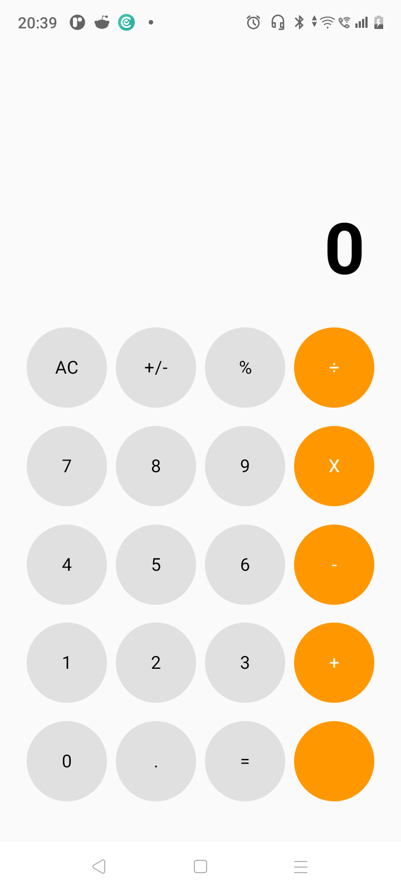

# Calculatorr

A modern calculator application built using **Kotlin** and **Jetpack Compose**.

## Screenshot

## Features

- Basic arithmetic operations
    - Addition
    - Subtraction
    - Multiplication
    - Division
- Decimal support
- AC (All Clear)
- Material Design inspired UI
- Built completely with Jetpack Compose

## Current Version

**v0.1.0 (Beta)**

## Upcoming Features

- Percentage (%)
- Plus/Minus (+/-)
- Better display formatting
- Divide-by-zero handling
- Responsive display for long numbers
- Scientific mode (planned)

## Tech Stack

- Kotlin
- Jetpack Compose
- Android Studio

## Status

🚧 Under active development.